<!-- metrics:start -->
| | |
|---|---|
| CVEs reported to maintainers | **3** |
| Malicious repositories confirmed | **141** |
| Malicious container images confirmed | **179** |
| Hunting since | **2026-06-14** |

_Updated 2026-10-05_
<!-- metrics:end -->

- **CVEs reported:** vulnerabilities reported privately to the maintainer. Package names are listed once the advisory is public.
- **Malicious repos:** confirmed by [git_warden](https://github.com/OpenSource-For-Freedom/git_warden).
- **Malicious containers:** confirmed by [KNORR](https://github.com/OpenSource-For-Freedom/KNORR).

Updated every Monday after the weekly hunts, and daily. Repositories are the running total in git_warden's evidence ledger, less reviewer-rejected false positives. Hunting began 2026-06-14, when git_warden started; KNORR joined 2026-07-07.

## Confirmed list

Every confirmed finding in the evidence store, less reviewer-rejected false positives. **OSM** reads `reported` when the ledger recorded the OpenSourceMalware submission; earlier reports filed before the ledger began show as `not recorded` (see [my submissions](https://opensourcemalware.com/my-submissions)). Names are shown as text, not links.

<!-- confirmed:start -->

<b>Malicious repositories (141)</b>

| Repository | Family | OSM |
|---|---|---|
| `123babayaga/zenithive_angular` | general | not recorded |
| `777genius/review-router-ai` | general | reported |
| `aaryan121/code-conductor-fork` | general | not recorded |
| `adan-asim/e-commerce-admin-app-backend` | general | not recorded |
| `addis-ale/git_learn` | general | not recorded |
| `agrawalchirag/corex` | general | not recorded |
| `aidevshakil055/achillcomfort_ai_repo` | general | not recorded |
| `allzone-technologies/canteen-pwa` | general | not recorded |
| `altura-hub111/altura-mvp` | general | not recorded |
| `anasbinarif/texas-2026` | general | not recorded |
| `anshuman-jha/toku_assestment` | general | not recorded |
| `antonver/defiguard-dev` | general | not recorded |
| `arif1101/restaurant-management-server` | general | not recorded |
| `arnoldesquivel/best-city436-poc` | general | not recorded |
| `asad-ghafoor/python-setup` | general | reported |
| `autonomys-nexus/autonomys` | general | not recorded |
| `bhnybrohn/cal-eco-platform` | general | not recorded |
| `bhoomikamehtastartbit/reactchakraui` | general | not recorded |
| `bloxberg-d/jackpot` | general | not recorded |
| `bsai/cal-eco-platform` | general | not recorded |
| `cataclypsme/old-web3-project` | general | not recorded |
| `cletusgizo/genetiq-v2--test-task` | general | not recorded |
| `collebrusco/frontier` | minecraft | reported |
| `crazydev13/school-management` | general | not recorded |
| `dapperlabsmd/dapperlabs-mvp` | general | not recorded |
| `darkbl0x/ddos-ripper-v2.1` | minecraft | reported |
| `data3rr/steal-eyes` | minecraft | not recorded |
| `david1savitsky/cal-eco-platform` | general | not recorded |
| `dawit212119/anbessa` | general | not recorded |
| `dawit212119/bus-admin` | general | not recorded |
| `dawit212119/eaglepoint-ai` | general | not recorded |
| `dawit212119/ecommerce-backend` | general | not recorded |
| `dawit212119/go` | general | not recorded |
| `dawit212119/nextebook` | general | reported |
| `dawit212119/wetruck` | general | not recorded |
| `devba/w3agregador` | general | not recorded |
| `devthedeveloper/w3glpop` | general | not recorded |
| `dishankchauhan/tech_test_pro-assignment` | general | not recorded |
| `djeday123/test_repo1` | general | not recorded |
| `duceboxedu/tiktoklikebot` | minecraft | reported |
| `dylanlittle/team-moshpit-project` | general | not recorded |
| `eastmade/web3project-momo-token` | general | not recorded |
| `eferos93/test4` | general | not recorded |
| `emandeveloper/datascience` | general | not recorded |
| `emigimenezj/solice2021-school-management-system` | general | not recorded |
| `fadi002/decompiled-stuff` | minecraft | reported |
| `findusman/pos_backend` | general | not recorded |
| `forthekingfck/lazyqol` | minecraft | not recorded |
| `gauravraisharma/ticketting-system` | general | not recorded |
| `hakeemsyd/fastapi-rag` | general | not recorded |
| `hammad911/datavisualizationproject` | general | not recorded |
| `haroldcalvo/workshop` | general | not recorded |
| `helidonashabani/student-management` | general | not recorded |
| `httphypixelnet/ratmod` | minecraft | reported |
| `huncholane/defi_property` | general | not recorded |
| `hvmgeeks/frontendengine1` | general | not recorded |
| `icecoldjay/bri` | general | not recorded |
| `ilyavafin/lol` | minecraft | reported |
| `ishanrt119/nft-marketplace` | general | reported |
| `itsmeblackops/wisepanda-bot-main` | general | not recorded |
| `jaxteller2016/social-app-mvp-poker-cra` | general | reported |
| `juanmantica123/funtico-tech-assestment` | general | reported |
| `kamilniftaliev/unipay` | general | not recorded |
| `khamid-v2022/auto-stacking` | general | not recorded |
| `kreliannn/house-rental-platform` | general | not recorded |
| `kreliannn/musicplayer` | general | not recorded |
| `kreliannn/pharmacy-management-backend` | general | not recorded |
| `laerciosimoes/giit-challenge-laercio` | general | not recorded |
| `lfirsl/morphix` | general | not recorded |
| `logixbuilttech/payload_posts` | general | not recorded |
| `lordhaka/photo` | minecraft | not recorded |
| `lordhaka/token-logger` | minecraft | reported |
| `luka147m/r-gradani` | general | not recorded |
| `lunagrabber/luna-grabber-2.1` | minecraft | reported |
| `markomilivojevic/ethvault_staking` | general | not recorded |
| `meharab/scam-origin` | general | not recorded |
| `mentarishub121/tokenpresaleapp` | general | reported |
| `modish0161/poo-land-app` | general | not recorded |
| `modish0161/tiger-world-maze` | general | not recorded |
| `mohamedeturki/shigud-clone` | general | not recorded |
| `motia/goldencity` | general | reported |
| `msmilan69/result-task` | general | not recorded |
| `mulagoto/vespy-grabber-v2.0` | minecraft | not recorded |
| `multi-too/luna-graber-main` | minecraft | reported |
| `nelsondev19/defi-property` | general | not recorded |
| `nilsrusten-dev/mysite` | general | not recorded |
| `niyathi-ramesh/test_demo` | general | not recorded |
| `noors-code/flask` | general | not recorded |
| `noors-code/medical-messaging` | general | not recorded |
| `noors-code/moviehouse` | general | not recorded |
| `noors-code/moviehouse-api` | general | not recorded |
| `noors-code/swarrpay-backend` | general | not recorded |
| `nurfarazi/3tier` | general | not recorded |
| `nurfarazi/auto-approve-hr` | general | not recorded |
| `nurfarazi/e-commerce-mvp` | general | not recorded |
| `nurfarazi/excel2google_autopilot` | general | not recorded |
| `nurfarazi/node-sql-playground` | general | not recorded |
| `nurfarazi/nono-chat-bot` | general | not recorded |
| `nurfarazi/piece_of_cake_laundry` | general | not recorded |
| `nurfarazi/safemailer-ts` | general | not recorded |
| `nurfarazi/sql-docker` | general | not recorded |
| `nurfarazi/user-management-using-cleanarchitecture` | general | not recorded |
| `prahaladbelavadi/coinlocatordemo` | general | reported |
| `pratikp72/brainbattle` | general | not recorded |
| `pratikp72/calendar-app` | general | not recorded |
| `pratikp72/strollr-app` | general | not recorded |
| `pratikp72/taoufik_ticket_management` | general | not recorded |
| `ricardomartins9899/smartpay-demo` | general | not recorded |
| `riteshahir28/myfirstproject` | general | not recorded |
| `riteshahir28/new-ritesh` | general | not recorded |
| `riteshahir28/onlineexamsystem` | general | not recorded |
| `riteshahir28/poll-voting-app` | general | not recorded |
| `riteshahir28/portfolio` | general | not recorded |
| `ru-yaka/p` | general | not recorded |
| `sabbirnde/nava` | general | reported |
| `saifullah-max/sound-cloud-downloader` | general | not recorded |
| `sergous/dlabs-platform-mvp2` | general | not recorded |
| `shamratx/ai-banking` | general | not recorded |
| `sharmapranay38/new_age_blockchain` | general | not recorded |
| `shimul-12/token-presale-dapp` | general | reported |
| `shri33/crypto-trading-platform` | general | not recorded |
| `shubhojit-17/home-assessment` | general | reported |
| `simalchaudhari/real-estate` | general | not recorded |
| `sky-cook/tokentradingdapp` | general | not recorded |
| `smit455/arc` | general | not recorded |
| `softvence-omega-cyber-monk/cheesuschrusty-server` | general | not recorded |
| `solarpy/caroline119-defi-property-4e3a113352e3` | general | not recorded |
| `solutionsdevop/bestcity-project` | general | not recorded |
| `sovkay/goldencity` | general | not recorded |
| `ta3pks/decentralized-social` | general | not recorded |
| `teeps-heisenberg/langchain-huggingface-generative-ai` | general | not recorded |
| `tlord101/hck` | general | not recorded |
| `umershafiq19/connectify` | general | not recorded |
| `umrasghar/webflow-automator` | general | not recorded |
| `uribresler/elevated-spaces-backend` | general | not recorded |
| `user2745/dev-test-kamto-kionos` | general | not recorded |
| `user2745/web3aggregator` | general | reported |
| `usmankhan16677/messageforge` | general | not recorded |
| `vasillax12/vasillaxsms` | minecraft | not recorded |
| `workonlly/interview_bucket` | general | not recorded |
| `yaroslav781/drainer` | general | reported |

<!-- confirmed:end -->
