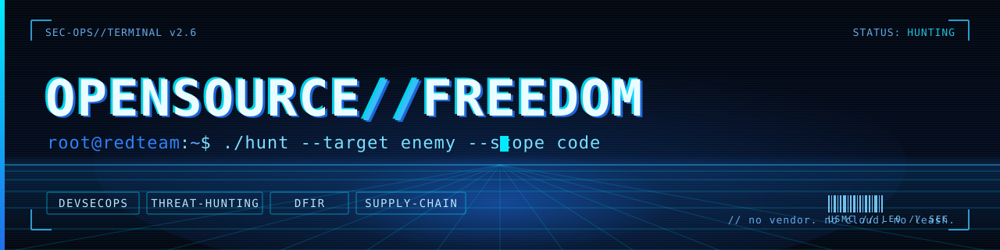

<!--
  GitHub PROFILE README  —  repo must be named EXACTLY: OpenSource-For-Freedom (PUBLIC)
  All header art is CODED (generated from a URL) — nothing to commit, nothing to break.
  The ONLY repo-hosted file is the Cyber Legion photo (see the // arsenal section).
-->

 

 

## `// whoami`

US Marine. Former law-enforcement gang investigator. Now a DevOps security professional. Same mission, new battlefield. I've spent my career hunting the enemy: first in uniform, then on the streets, and now in code. The discipline never changes. Find the threat, learn how it operates, shut it down.

Today I build and ship security engineering across the full DevSecOps lifecycle: hardened CI/CD, supply-chain defense, runtime threat detection, and incident response. Shift-left in the pipeline, watch hard at runtime, and run the investigation when something slips through. Detection, forensics, and threat intel built to run on **your** infrastructure with no cloud dependency and no vendor leash.

Everything here is original and end-to-end, from low-level Rust and eBPF runtime internals to local AI analysts that explain a finding in plain language. The throughline is **open source for freedom**: real security capability that isn't locked behind a paywall.

## `// arsenal`

### [Legion](https://github.com/OpenSource-For-Freedom/legion)
**Local threat detection, backed by your own AI SOC.**

> Cover art: [**Cyber Legion // Hunter Unit VII**](https://github.com/OpenSource-For-Freedom/legion/wiki/Legion) — on the Legion wiki.

Watches installed packages, files, and network connections against live threat feeds (CISA KEV, AbuseIPDB) and detection rules. Then **Ares**, an AI analyst running entirely on-box, explains every finding in plain English. Browser dashboard plus CLI, Windows and Linux, zero cloud. Your telemetry never leaves the machine.

 

### [WRAITH](https://github.com/OpenSource-For-Freedom/wraith)
**Windows incident response and threat hunting.**

A native Windows triage app running 14 scan modules: YARA signatures, behavioral heuristics, persistence and process analysis, surfaced through a dark WPF dashboard. Runs alongside Defender and feeds Microsoft Sentinel. Enterprise-grade hunting without the enterprise invoice.

### [Git Warden](https://github.com/OpenSource-For-Freedom/git_warden)
**The warden of malicious repositories and code.**

A threat-intel engine that discovers, statically analyzes, and catalogs malicious GitHub repositories. Ingests MITRE ATT&CK, CISA, and OpenSourceMalware feeds, traces repo lineage, and publishes the evidence to a public Wall of Shame. Static analysis only; nothing hostile ever executes.

### [SOURCE](https://github.com/OpenSource-For-Freedom/SOURCE)
**Automated malicious-IP intelligence.**

An auto-updating database of malicious IPs with geolocation and ASN enrichment. Aggregates trusted feeds, applies severity scoring, maps offenders geographically, and exports queryable CSV/SQLite, refreshed weekly via GitHub Actions. Built for SOCs and threat hunters.

### [Legion Runner](https://github.com/OpenSource-For-Freedom/Legion_runner)
**Ephemeral, eBPF-aware CI.**

Disposable GitHub Actions and local CI runners built in Rust with eBPF-level visibility. Secure, single-use build infrastructure for supply-chain-aware pipelines.

## `// stack`

 

